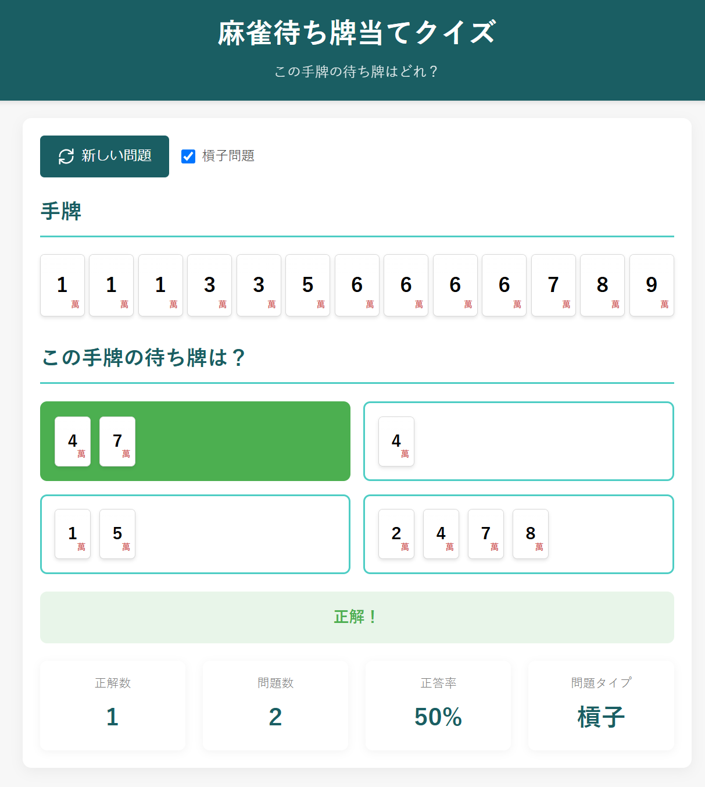

# Mahjong Tenpai Quiz（麻雀待ち牌当てクイズ）

シンプルでインタラクティブな麻雀の待ち牌判定トレーニングツールです。テンパイ手を表示し、その手牌が待っている牌のパターンを当てるクイズ形式のWebアプリケーションです。

## 機能

- **待ち牌当てクイズ**: ランダムに生成されたテンパイ手の待ち牌パターンを当てるクイズ
- **槓子問題モード**: 同じ牌が4枚ある特殊な手牌に対応した問題を出題
- **多様な待ち牌パターン**: 一般的な面子手や七対子など、さまざまなテンパイ形に対応
- **正答率の表示**: クイズの成績を記録し、正答率を表示
- **モバイル対応**: レスポンシブデザインで様々なデバイスに対応

## URL

https://yourusername.github.io/mahjong-tenpai-quiz/
